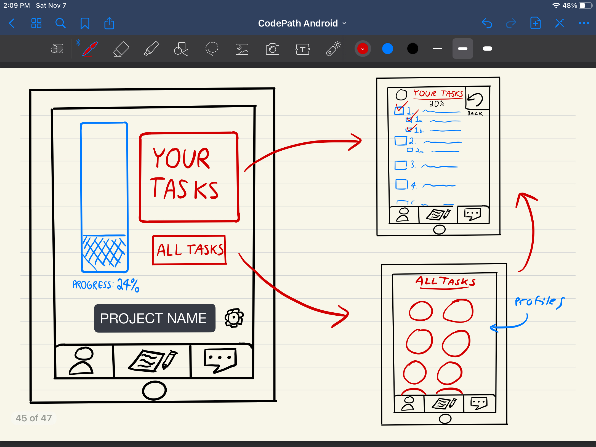
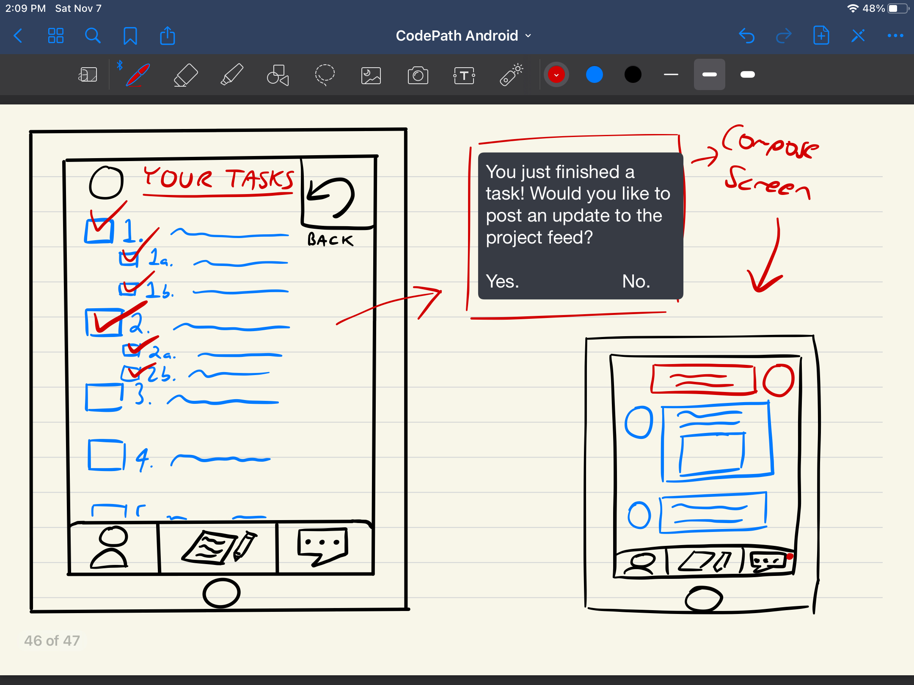
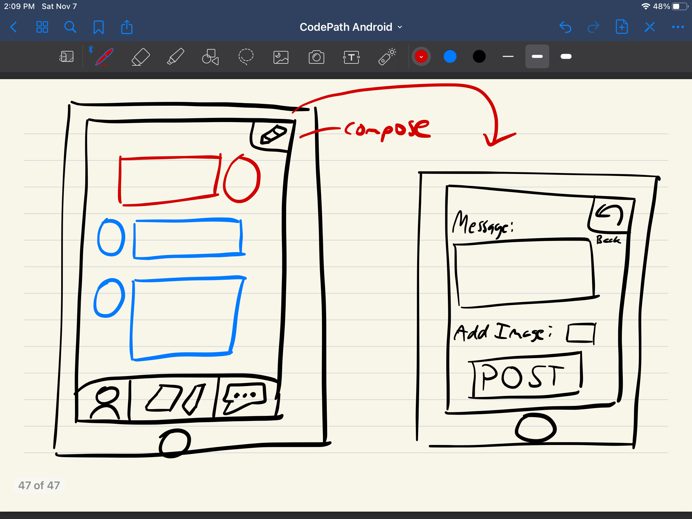

# ShareLabs
ShareLabs is an Android application that allows users to easily create and track progress on their tasks and collaborate with other users interested in having group projects.

## Table of Contents
1. [Overview](#Overview)
1. [Product Spec](#Product-Spec)
1. [Wireframes](#Wireframes)
2. [Schema](#Schema)

## Overview
### Description
Our app allows a group of people to come together and create a project. When you create a project, you are able to invite others to it and create initial tasks for them, as well as a project deadline. Once the project is initialized, the group members are able to check off what tasks they've finished and post to a shared update feed to inform others of their progress. You can easily see the cumulative progress of your work on the main project screen via a progress bar, as well as see the tasks of other group members.

### App Evaluation
- **Category:** Social Networking/ Productivity
- **Mobile:** This app would mainly be designed with the idea that one would finish tasks throughout the day, using their phone to easily access the app, check off what they have done, or view the progress of others over time.
- **Story:** Users come together to complete a project. When you finish a task, you can send a message to a group feed to update them of progress, or remind someone else to finish their tasks before the deadline.
- **Market:** Anyone could use the app, and invite others that they know to work together. This is an all ages app, but it would make the most sense to use this in family/friend/work groups rather than with strangers.
- **Habit:** The app is designed to be checked on a few times a day, and the user will be able to see at a glance how much cumulative progress has been made on the project.
- **Scope:** First we would like to focus on using the app for personal purposes such as families, friends, or work groups. However, in the future, we could possibly expand this and add features that could allow anybody to invite others who they think would fit their project. This would most likely be done using a preferences and ratings system, that would allow people to invite others to their project depending on their skills, interests, and reliability.

## Product Spec

## User Stories (Required and Optional)

### Required Stories

- User can create an account with a unique username
- User can login
- User can see overview of project name, progress on project, where to access his or her own individual tasks, where to access all tasks
- User can access his or her own individual tasks
- User can access all tasks 
- User can create tasks 
- User can see his or her own profile
- User can see progress on his or her own individual tasks
- User can see profiles of other users
- User can see tasks of other users 
- User can see progress on tasks of other users
- User can post updates and comments about project
- User can view a description of the app

### Optional Stories

- User can edit their own profile picture
- User can change the color and design of the project overview screen
- User can view a description of the project

# Screen Archetypes

- Sign up screen
    - User can create an account with a unique username
- Login screen
    - User can login
- Home screen
    - User can see overview of project name, progress on project, where to access his or her own individual tasks, where to access all tasks
- Your tasks screen
    - User can access his or her own individual tasks
    - User can see progress on his or her own individual tasks
- All tasks screen
    - User can access all tasks 
    - User can see profiles of other users
- Settings screen
    - User can view a description of the app
- Profile screen
    - User can see his or her own profile
    - User can see tasks of other users (by landing on the profile screens of other users) 
    - User can see progress on tasks of other users (by landing on the profile screens of other users) 
- Compose screen
    - User can create tasks 
    - User can post updates and comments about project
- App description screen (provides functionality for optional stories)
    - User can change the color and design settings of the project overview screen

# Navigation

## Tab Navigation

- Your tasks tab  
    => Your tasks screen
- All tasks tab  
    => All tasks screen
- Settings tab  
    => App description screen (provides functionality for optional stories)
- Profile tab  
    => Profile screen
- Project view tab  
    => Home screen
- Compose tab  
    => Compose screen
- “Yes” tab (Clicked “Yes” to “You just finished a task! Would you like to post an update to the project feed?”)  
    => Compose screen
- “No” tab (Clicked “No” to “You just finished a task! Would you like to post an update to the project feed?”)  
    => Your tasks screen
    
## Flow Navigation

- Sign up screen  
    => Login screen  
- Login screen  
    => Home screen  
- Home screen   
    => Your tasks screen  
    => All tasks screen  
    => Settings screen  
    => Profile screen  
    => Home screen  
    => Compose screen  
- Your tasks screen  
    => Profile screen  
    => Home screen  
    => Compose screen  
- All tasks screen  
    => Your tasks screen  
    => Profile screen  
    => Home screen  
    => Compose screen  
- Settings screen  
    => Profile screen  
    => Home screen  
    => Compose screen  
- Profile screen  
    => Profile screen  
    => Home screen  
    => Compose screen  
- Compose screen  
    => Profile screen  
    => Home screen  
    => Compose screen  
- App description screen (provides functionality for optional stories)  
    => Profile screen  
    => Home screen  
    => Compose screen  

## Wireframes

### Digital Wireframes & Mockups

### Interactive Prototype

## Schema 
[This section will be completed in Unit 9]
### Models
[Add table of models]
### Networking
- [Add list of network requests by screen ]
- [Create basic snippets for each Parse network request]
- [OPTIONAL: List endpoints if using existing API such as Yelp]
